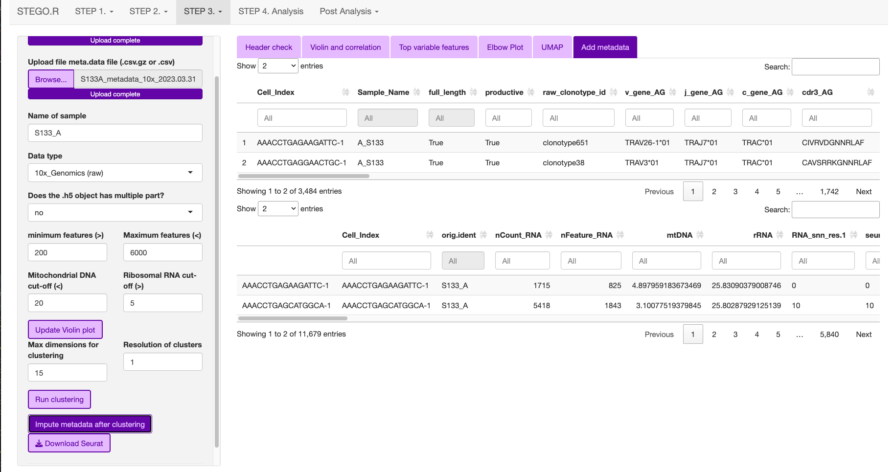
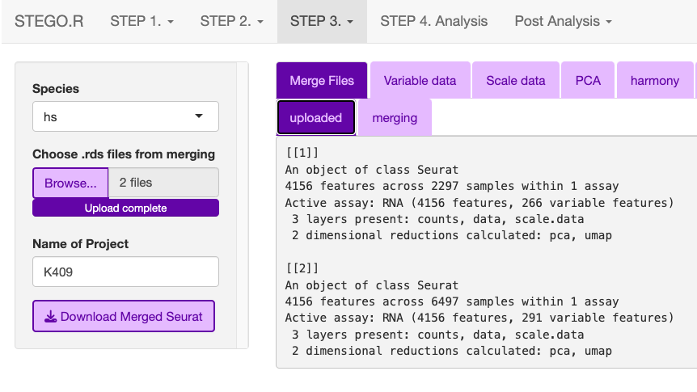
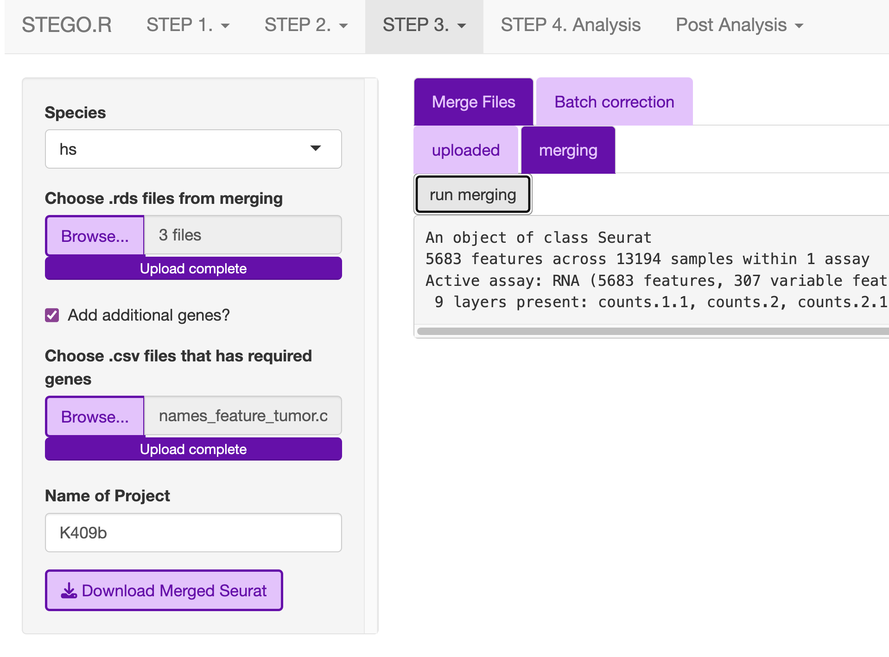
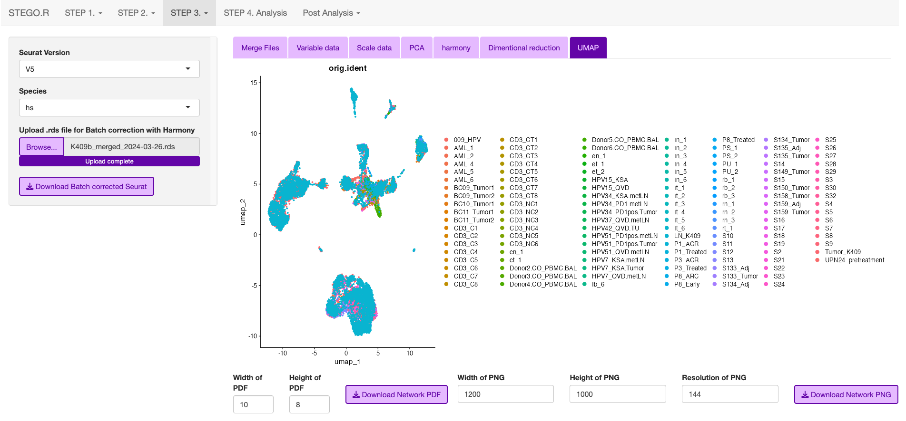
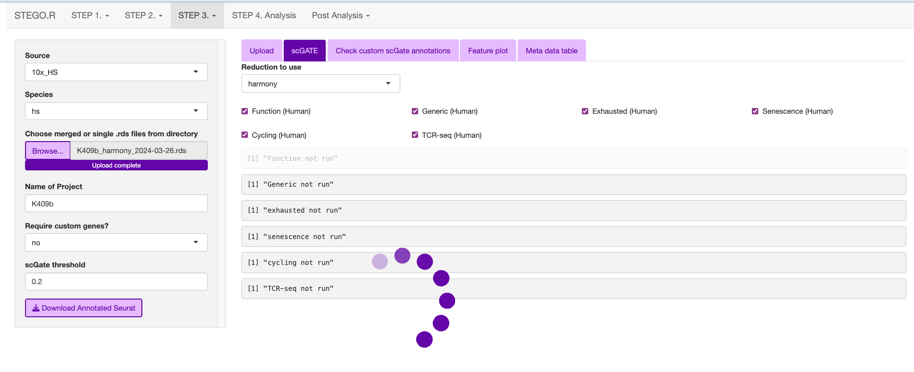
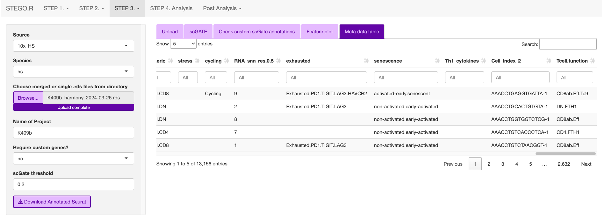
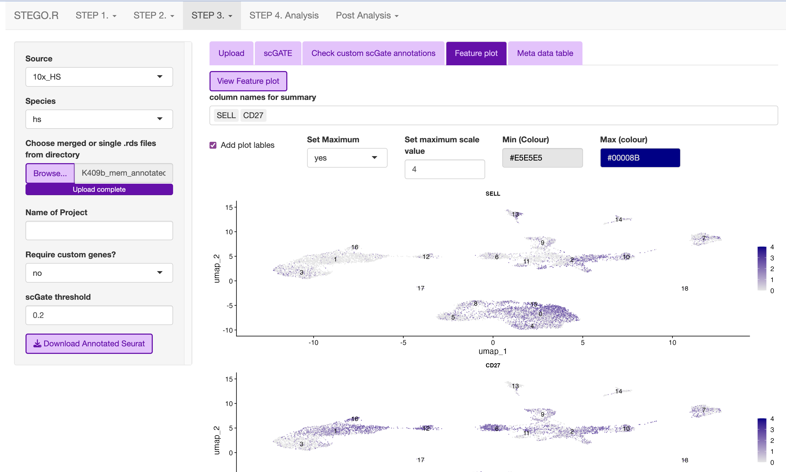
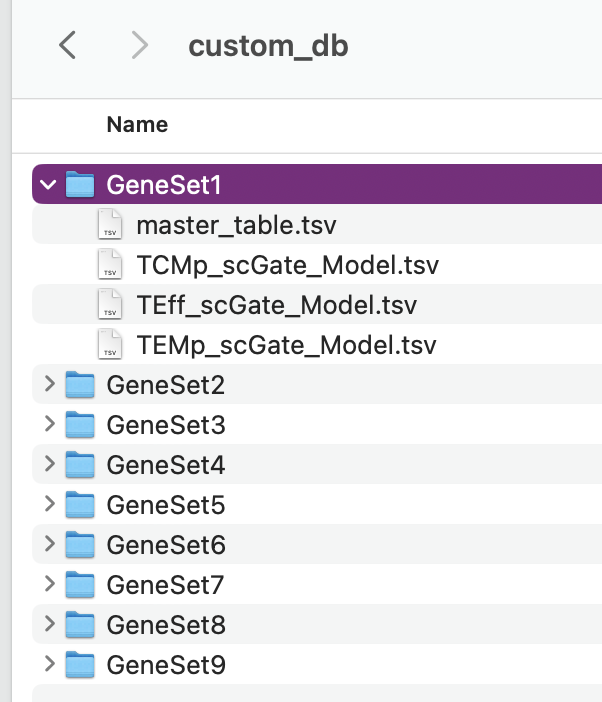
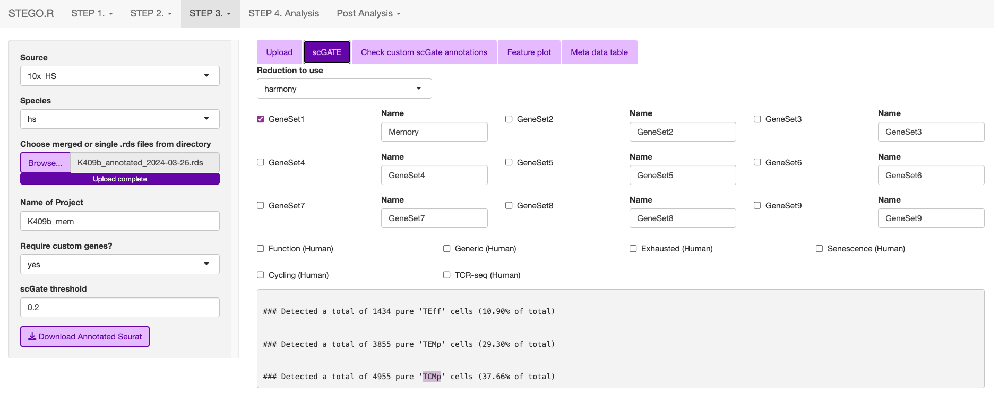
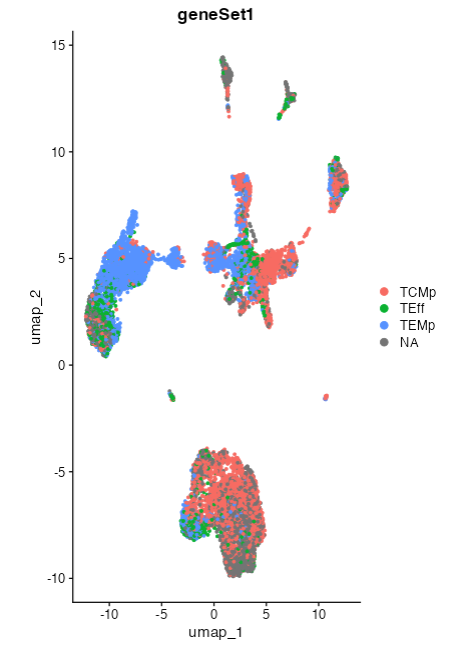

Step 3. Quality control
=======================

.. note:: 
    Consideration for the analysis.  
        Steps 3b and 3c can be done either in the interface or with the command-line code in the "merging.batch.harmony.R" in the project directory.
    Prerequisite
        Completed the step 1. foramtting and have the two files (matrix.csv and meta.data.csv files in the 1_SeuratQC folder) 

**3a.** Quality control of a Seurat object
------------------------------------------------------------------

**This section describes the Seurat QC process for human samples with 10x Genomics.**

.. image:: img/3a.png
  :width: 200
  :alt: Alternative text

1. Upload both the meta-data.csv file and the matrix file (.csv.gz, .csv or .h5). 
2. Add the file name, which will be identical to the previous file name.
3. Select the data origin, as it will change the cut-off settings.
      - 10x Genomics >2500 features (transcripts per cell), are deemed to be doublets.
      - BD Rhapsody Immune panel > 150 features, are deemed to be doublets.
4.   Check that the file was uploaded
5.   Look at the first volcano plot "before" tab, as we need to check the cut-off for the MtDNA and rDNA cut-offs
      - MtDNA standard cut-off less than 20%
      - rRNA standard cut-off is greater than 5%. If there is no rRNA genes identifed, set value to 0 or the program will crash due to no cell's remaining.

6. Once the settings have been configured, hit update. This will add the File name.

.. image:: img/3a_AfterViolin.png
  :width: 600
  :alt: Alternative text

7. The user can then inspect the presence of the top variable features, elbow plot and Heatmaps. The latter two plots are to aid in setting the number of dimentions to use for the UMAP dimentional reduction. Default is set to 15. The resolutions are used for the unsupervised clustering. *Note: we recommend using scGate for the annotation  rather than the unsupervised clusters as it is not suitable for identifying subtle differences in T cell sub-populations.*

8. In the side panel, hit the "Run clustering" button to run the dimentionality reduction.

.. image:: img/3a_UMAP.png
  :width: 600
  :alt: UMAP

9. In the "Add meta data", first check that the file has uploaded correctly.

10. Now your file has completed the Seurat QC and has had the TCR sequences added to the meta-data. click the "Download Seurat" object and save it to the **"2_SCobj"** folder.

**command-line equivalent**

Once the user has identified the parameters for filtering, we recommend using the command-line function that automates this process. 

::

    ###### Step 3a. Automated file filtering ------
    # default parameteres: folder = "1_SeuratQC", dataset_type = "10x", species = "hs",  features.min = 200, features.max = 6000, percent.mt = 20, percent.rb = 5, dimension_sc = 15, resolution_sc = 1, limit_to_TCR_GEx = F, save_plots = T

    # run defaults for 10x based on seurat. 
    automated_sc_filtering(dataset_type = "10x")
    
    # BD Rhapsody (immune panel) -----
    automated_sc_filtering(dataset_type = "BD_rap",features.min = 45,features.max = 160, percent.mt = 0, percent.rb = 0)

 
**3b.** Merging multiple Seurat objects and batch correction.
------------------------------------------------------------------

This section explains how to merge multiple .rds objects and correct for batch effects. 

Merging
^^^^^^^

1. From the **"2_SCobj"** upload all the .rds files.

2. Download the merged.rds object

** For repeated file merging and annotating, the program window may disappear, so we recommend merging and annotating using command-line functions **

::

    require(STEGO.R)
    ###### merging seurat object ------
    # Check that you are in the correct working directory with your RDS files
    merging_multi_SeuratRDS(set_directory = "2_scObj/", merge_RDS = F, pattern_RDS = ".rds$") 
    
    # once that is check, switch merge_RDS to TRUE or T
    sc_merge <- merging_multi_SeuratRDS(set_directory = "2_scObj/", merge_RDS = T, pattern_RDS = ".rds$") 
    
    # merges the different layers in V5 of seurat 
    sc <- JoinLayers(sc_merge,  assay = "RNA") 
    
    # save the merged file - it will not have the scaled data and PCA stored any more due to the merging process. 
    saveRDS(sc_merge,"2_scObj/sc_merge.rds") 

batch correction 
^^^^^^^^^^^^^^^^

1. Wait for the files to finish uploading before proceeding 
2. Update the Project name e.g., BreastCancer
3. Hit the bottons in each tab in the following order:
    - Run VariableFeatures
    - Run Scale
    - Run PCA
    - Run Harmony *Note: Harmony R package is used for the batch correction.* 
    - Run Dimentional Reduction

4. Once completed click the "Download merged Seurat"

.. note::

    .. raw:: html

        * Visit <a href="https://www.nature.com/articles/s41592-019-0619-0" target="_blank">Harmony publication</a> for more detail.

*Note: Depending on the number of files, and total number of cells will impact the speed of merging*

If you have more than a few files to merge and annotate, we recommend using the following code: 

::

    require(STEGO.R)

    sc <- readRDS("2_scObj/sc_merge.rds")

    ## perform the harmony batch correction ------
    sc <- harmony_batch_correction_1_variableFeatures(file = sc)
    sc <- harmony_batch_correction_2_Scaling(file = sc, Seruat_version = "V5")
    sc <- harmony_batch_correction_3_PC(file = sc)
    sc <- harmony_batch_correction_4_Harmony(file = sc)
    saveRDS(sc,"2_scObj/sc_harmony.rds")

**3c.** Annotating the Seurat object
------------------------------------

This section describes how to annotated the files either from the "default" and/or "custom" modules with scGate. If you have large files, we recommend using scripts and not the interface. 

Upload the merged file to commence the annotation process. 

This is what the window will print once the annotation is completed.

.. image:: img/3c_processed_anno.png
  :width: 750
  :alt: Alternative text

The annotations are added to the end of the meta data table in the Seurat object. 

::

    require(STEGO.R)

    #### annotating Seurat object -----
    sc <- readRDS("2_scObj/sc_harmony.rds")

    sc <-     scGate_annotating(
              file = sc,
              TcellFunction = T,
              generic = T,
              immune_checkpoint = T,
              senescence = T,
              cycling = T,
              Th1_cytokines = T,
              TCRseq = T,
              threshold = 0.25, # change to 0.55 if you use the focused BD Rhapsody immuen panel 
              reductionType = "harmony",
              chunk_size = 50000
            )
    
    sc@meta.data$Cell_Index_old <- sc@meta.data$Cell_Index
    sc@meta.data$Cell_Index <- rownames(sc@meta.data)
    
    saveRDS(sc,"3_analysis/sc_anno.rds")

Default annotation models with scGate
^^^^^^^^^^^^^^^^^^^^^^^^^^^^^^^^^^^^^

The scGate threshold was set to 0.2 for full capture and 0.55 for the immune panel (<400 transcripts). 

* **Human** 
    - TcellFunction (see Annotation table)
    - immune checkpoint
        + Based on four markers: PDCD1 (PD-1), TIGIT, (LAG-3) and H
    - Senescence
        + Activated (B3GAT1+CD28+)
        + activated-early/senescent (B3GAT1-CD28-)
        + non-activated/early-activated (B3GAT1-CD28+)
        + Terminally differentiated (B3GAT1+CD28-)
    - Cycling (e.g., cell division)
        + MKI67+TOP2A+
        + This is the same as cell division 
    - Th1_cytokines 
        + combination of IFNG and TNF
    - TCRseq (meta.data TCR-seq)
        + MAIT cells (TRAV1-2 TRAJ33/12/20)
        + iNKT cells ()
        + possible CD1b/c restricted 
        + ab T cells (excludes the above categories)
        + gd T cells

* **Mouse** 

*Note: Under development.*

Functional T cell annotations
^^^^^^^^^^^^^^^^^^^^^^^^^^^^^

.. raw:: html

   

     
Annotation Table

.. csv-table::
    :header-rows: 1
    :file: path/anno_table.csv
    :widths: 20, 30, 50
    :class: longtable

.. raw:: html

   

.. raw:: html

   

     
Annotation Details

   Cyto = GZMA, GZMB, PRF1, GNLY, NKG7

   Naive = CCR7, SELL

   DN = double negative; Th = T helper, Tfh = follicular T helper, Tc = cytotoxic T cell; Treg = regulatory T cell

   

Simple T cell annotations
^^^^^^^^^^^^^^^^^^^^^^^^^^^^^

.. raw:: html

   

     
Simple Annotation Table

.. csv-table::
    :header-rows: 1
    :file: path/anno_table_simple.csv
    :widths: 20, 30, 50
    :class: longtable

.. raw:: html

   

.. raw:: html

   

     
Simple Annotation Table

   Cyto = GZMA, GZMB, PRF1, GNLY, NKG7

   Naive = CCR7, SELL

   DN = double negative; Th = T helper, Tfh = follicular T helper, Tc = cytotoxic T cell; Treg = regulatory T cell

   

Creating custom annotation stratergies
^^^^^^^^^^^^^^^^^^^^^^^^^^^^^^^^^^^^^^

The user can add additonal annotations beyond the default. 

There are nine custom databases that a user can amend. If needed, these can be added to an already annotated file.

**Design your custom marker set**

Check that the cells express the markers under the "marker check" tab.
    - To run, click the 'View Feature plot'

Design the panel to add into the nine custom databases in **custom_db** folder

Do not rename the master file. However, the file will need to be altered to set the markers. The user will need to define the name as well as the singature (gene list). If multiple genes are used, separate with ; as per the scGate documentation. 

The user can alter the names in front of the _scGate_Model.tsv, while the latter is used to find each type of annotation. 

To use scGate effectively, the genes within a set are read as OR (either of the marker need to be present), while the levels equate to AND i.e., All markers need to be present. These levels then need to be defined as positive or negative under the use_as column. 

Use a fresh run of the app, so the new database is read into, otherwise it will be the default. 

.. image:: img/3c_running the_mem.png
  :width: 600
  :alt: Alternative text

Run just the custom annotation needed. 

Check that there the signal overlaps with the gene expression, as per the feature plot. Once this is what you expect, download the object.

**3d.** Removing samples (optional)
-----------------------------------

This section allows the user to remove problematic cells based on any of the information in the meta data. This could be used to remove problematic samples post QC. Reasons for removal may be due to poor TCR-seq coverage. Also, you could limit the analysis to cells with both the GEx and TCR-seq present. 

Additionally, this step can be used to extract certain samples. For instance, we extracted the 

.. image:: img/3d_removing samples_from_md.png
  :width: 600
  :alt: Alternative text

Under development: Downsampling. This section will be used for limiting to an even number of cell per annotation model and/or dataset origin to add a background data for smaller data to help with the FindMarker statistic. 

**3e.** Re-formatting meta-data 
----------------------------------------------

In instances where the user has already done the QC, they will need to reformat their meta-data to make it compatible with STEGO.R formatting. 

The currently available formatting is for scRepertoire that has:

1. TCR1 (Alpha v_gene j_gene) and TCR1_cdr3
2. TCR2 (BETA v_gene j_gene) and TCR2_cdr3

